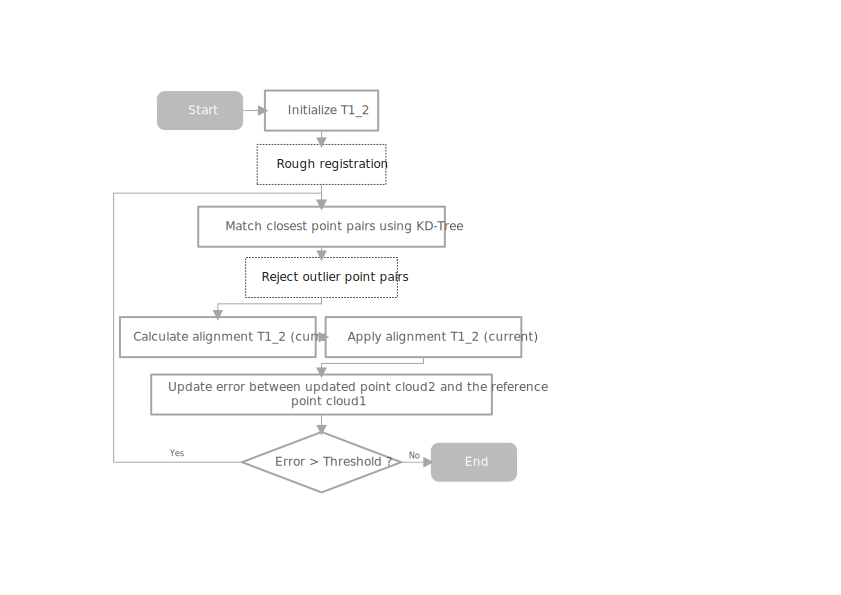

# Improved SVD-Based ICP

An easy script about using SVD-based ICP algorithm to register 2 point clouds in Python, where KD-Tree is used to find the correspondence.

What features we have:
1. KD-Tree, for matching the closest point pairs, i.e., the correspondence. 
2. Rough registration, before the iterative update.
3. Rejection of outlier point pairs, with a threshold could be set.



## 1 Requirements

- The script has been tested on `Python==3.8.20`.

- Install all dependent packages:

```
pip3 install -r requirements.txt
```


## 2 How to use

- Make sure your point cloud files are put in folder `data`.

- Or simply modify your customer point cloud file path in `improved_icp_based_on_svd.py`.

- Run the script, feel free to change the ICP threshold and the number of iteration:

```
python improved_icp_based_on_svd.py
```

## 3 What to expect

- A iteration process visualization


- The convergence curve along each iteration


## 4 One more thing

Please contact maijy1010@163.com if any question you might have. MIT Lisense. Acknowledgements to NUS.
